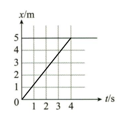

# 1.2 位移，速度，时间，加速度的关系

## 1.2.1 公式

### 公式一

我们在[基础知识](./基础知识)这一节讲过，加速度是速度的变化率，那么我们可以得出在一段时间内速度变化的值

$$
\Delta v = at
$$

最后我们再加上初速度，这个公式就是：

$$
v_t = v_0 + at
$$

::: tip 例题

一辆汽车以$v_0 = 10m/s$的速度行驶，在$t = 2s$时，速度变为$v_t = 15m/s$，求加速度。

解：

由运动学公式$v_t = v_0 + at$可以得：

$$
a = \frac{v_t - v_0}{t} = \frac{15 - 10}{2} = 2.5m/s^2
$$

:::

### 公式二

$$
x = v_0t + \frac{1}{2}at^2
$$

::: tip 例题

一辆汽车以$v_0 = 10m/s$的速度行驶，在$t = 2s$时，速度变为$v_t = 15m/s$，求加速度。

解：

由运动学公式$x = v_0t + \frac{1}{2}at^2$可以得：

$$
a = \frac{v_t - v_0}{t} = \frac{15 - 10}{2} = 2.5m/s^2
$$

:::

### 公式三

$$
v_t^2 - v_0^2 = 2ax
$$

::: tip 例题

一辆汽车以$v_0 = 10m/s$的速度行驶，在$t = 2s$时，速度变为$v_t = 15m/s$，求加速度。

解：

由运动学公式$v_t^2 - v_0^2 = 2ax$可以得：

$$
a = \frac{v_t^2 - v_0^2}{2(x - x_0)} = \frac{15^2 - 10^2}{2(2 - 0)} = 2.5m/s^2
$$

:::

这就是基础的三个公式以及它的用法

## 1.2.2 运动图像

### x-t图像的分析

x-t图像指的是位移与时间的关系图像，我们通过图像可以分析出速度的变化情况，加速度的变化情况，以及速度与位移的关系

如上图所示，此质点的位移从0开始，经过四秒后运动了5m

接下来我们来探究他的斜率，斜率代表着他的速度。因为一次函数的斜率是固定的，所以我们可以通过斜率来判断速度的变化情况

- 当斜率为正时，速度是增加的
- 当斜率为负时，速度是减少的
- 当斜率为0时，速度是保持不变的

那么如何计算斜率呢？初中数学告诉我们一次函数的通式是

$$
y = kx + b
$$

那么我们就可以得出：

$$
x = kt + b
$$

而这里的$k$就是我们常说的斜率，他的计算公式是

$$
k = \frac{x_2 - x_1}{t_2 - t_1}
$$

等等？$\frac{x}{t}$ ？这不是速度的公式嘛？没错，斜率就代表着他的平均速度，而我们又知道斜率越大代表着一次函数越陡，所以x-t图像越陡，他的速度越大

### v-t图像的分析

v-t图像指的是速度与时间的关系图像，我们通过图像可以分析出速度的变化情况，加速度的变化情况，以及速度与位移的关系

如上图所示，此质点的速度从0开始，经过四秒后速度变化了4m

接下来我们来探究他的斜率，斜率代表着他的速度。因为一次函数的斜率是固定的，所以我们可以通过斜率来判断速度的变化情况

- 当斜率为正时，速度是增加的
- 当斜率为负时，速度是减少的
- 当斜率为0时，速度是保持不变的

同样，v-t函数的图像越陡，代表着他的加速度越大