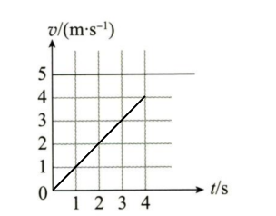

# 匀变速直线运动

## 1.3.1 定义

我们先来看看匀变速直线运动的定义

```txt
匀变速直线运动指一个物体沿着直线运动，在运动过程中，速度和时间成正比，即速度与时间成一次函数关系，同时加速度保持不变
```

我们在上一节课中提到了v-t图像：



这就是匀变速直线运动的图像

当你试着画出他的a-t图像，你会发现图像的斜率为0，说明加速度没有在变化

## 1.3.2 中间时刻的推论

做匀变速直线运动的物体，在某段时间内的平均速度，等于该段时间内中间时刻的瞬时速度，即

$$
v_{平均}=\frac{x}{t}=\frac{1}{2}(v_0 + v) = v_\frac{t}{2}
$$

## 1.3.3 中间位移的推论

某段位移的终点的瞬时速度大小与初速度$v_0$有这么一个数学关系：

$$
v_\frac{x}{2} = \sqrt{\frac{v_0^2 + v^2}{2}}
$$

## 1.3.4 位移差的推论

对于任意一个做匀变速直线运动的物体，都有：

1. 任意两个连续相等的时间内，位移差为一个衡量，即：

  $$
  \Delta x = aT^2 = 衡量
  $$

2. 由1可以推导出，第$M$个$T$时间内与第$N$个$T$时间内，位移差有以下关系：

  $$
  x_M - x_N = (M - N)aT^2
  $$

## 1.3.5 初速度为0的匀加速直线运动的特点

### 按时间等分

1. 1T末，2T末，...，nT末瞬时速度之比为：

  $$
  1:2:...:n
  $$

2. 1T内，2T内，...，nT内位移之比为：

  $$
  1:2^2:...:n^2
  $$

3. 第一个T内，第二个T内，..., 第n个T内，位移之比为：

  $$
  1:3:...:2(n - 1)
  $$

### 按位移等分

1. 通过前x，前2x，前nx末速度之比为：

  $$
  \sqrt{1}:\sqrt{2}:...:\sqrt{n}
  $$

2. 通过前x，前2x，前nx的位移所用时间之比为：

  $$
  \sqrt{1}:\sqrt{2}:...:\sqrt{n}
  $$

3. 通过第一个x，第二个x，第n个之比为：

  $$
  1 : (\sqrt{2} - 1) : (\sqrt{3} - \sqrt{2}) : ... : (\sqrt{n} - \sqrt{n - 1})
  $$


