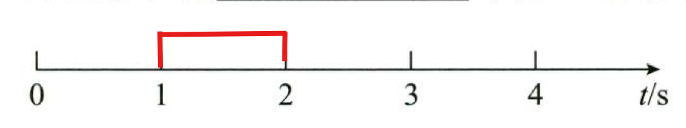

# 1.1 基础知识

## 1.1.1 质点

何为质点？我们先来看一下它的定义：

```
质点是没有大小和体积，只有质量的一个理想模型
```

当我们研究的对象不需要涉及到大小，体积之类的值，我们就可以把它看成一个质点，如地球绕着太阳公转时，我们只需要研究他的位置和运动轨迹，不需要研究他是什么形状，这时候我们就可以把地球看成一个质点；但是我们研究地球自转时，需要具体到地球的旋转角度等一些细节，这时候需要考虑到地球的形状，这时就不能把他看成一个质点

## 1.1.2 参考系

物体的运动总是相对的，要描述一个物体的运动，首先要选定某个其他物体为参考，然后我们假定这个物体是绝对静止的（事实上自然界不存在绝对静止的物体），也就是坐标系的原点，然后再来判断某个物体相对于这个“原点”是否运动了。

而这种“原点”般的物体，我们把它叫做参考系

## 1.1.3 时间间隔和时刻

- 时间间隔：一段有长度的时间，比如我吃饭用了十分钟，这个“十分钟”就是时间间隔
- 时刻：指具体的某一个点，比如我在5:20睡觉13:14起（玩个梗），这里的"5:20"和"13:14"就是时刻

总结：时间间隔是时间轴上的一个区间，而时刻则是时间轴上的一个点

时间的表述一般在题目中分为以下三种：

1. 第n秒（内）（指时间间隔）
	如以下是第2秒内
	
2. 第n秒初/末（指时刻）
	如以下两个点从左往右看是第2秒初和第2秒末
	

3. 前n秒（指时间间隔）
	如以下是前两秒
	

## 1.1.4 位移与路程

- 位移：一个有大小方向的矢量，总是从运动开始的地方指向运动结束的地方
- 路程：一个只有大小，没有方向的常量


比如，一个质点从A点运动到B点，以上三条全都是路径，因为他们只有大小，没有方向

位移总是从出发点指向终点，所以我们来画一个位移：


## 1.1.5 速度与速率

- 速度：速度是一个有大小和方向的矢量，表示质点在某一时刻的速度
- 速率：速率是一个有大小，没有方向的常量，表示质点在某一时刻的速率
- 速度大小：速度大小是一个有大小，没有方向的常量，表示质点在某一时刻的速度大小

单位：$m/s$

计算公式：$\text{速度大小}=\frac{\text{路程}}{\text{时间间隔}}$

需要注意的是，在题目中，我们一般不会区分速度和速率，因为它们在题目中都是用速度来表示的

需要注意的是，在日常的解题中，我们一般不会区分速度和速率，因为它们在题目中都是用速度来表示的

接下来我们来看一下瞬时速度的定义：

```txt
瞬时速度：质点在某一时刻的速度大小
```

值得一提的是，我们接下来会用极限思想去解题，即将时间间隔看作一个无穷小，这样我们就可以把瞬时速度看做速度大小


## 1.1.6 加速度与加速度大小

- 加速度：加速度是一个有大小和方向的矢量，表示质点在某一时刻的加速度
- 加速度大小：加速度大小是一个有大小，没有方向的常量，表示质点在某一时刻的加速度大小

单位： $m/s^2$

计算公式：$\text{加速度大小}=\frac{\text{速度大小}}{\text{时间间隔}}$

相信看到这里的你肯定一脸懵逼，许多人无法接受“加速度”这个新概念，其实，加速度的本质就是速度的变化率，何为变化率？

我们来举一个例子，比如我们有一个质点，他运动的位移从0开始，经过10秒后，位移为10，那么我们就可以说，质点的位移从0变化到10，变化率就是10

所以，速度是位移的变化率，那么同样的道理，加速度就是速度的变化率，所以加速度的大小就是速度的变化率


